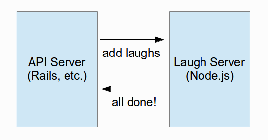

# Error Handling in Node.js

Paul A. Jungwirth

NodePDX

May 2013

# Laugh Track Server

* Asynchronous
* Webhook callback to indicate success or failure

# No error handling

    @@@ javascript
    function encodeLaughTracks(infile) {
      for (var i = 1; i <= 3; i++) {
        var cmd = "../laugh.rb -q " + i + " " + infile;
        console.log(cmd);
        exec(cmd, function (error, stdout, stderr) {
          if (error) throw error;
          notifyCaller(infile, true);
        });
      }
    }   

    function notifyCaller(infile, success) {
      console.log("finished adding laughs to " + infile);
      // HTTP POST to indicate success or failure
    }

* Lost requests
* No stack context

# Callbacks vs. Stack

    /home/paul/src/node-errors-talk/src/orig/app.js:10
        if (error) throw error;
                         ^
    Error: Command failed: 
        at ChildProcess.exithandler (child_process.js:634:15)
        at ChildProcess.EventEmitter.emit (events.js:98:17)
        at maybeClose (child_process.js:732:16)
        at Process.ChildProcess._handle.onexit (child_process.js:799:5)

# forever.js?

* Automatically restarts node whenever it dies.
* That exception will still kill our server, so now the jobs will never finish.
* Restart the server to keep handling requests, but all current requests just died.

# listen for uncaughtException?

    @@@ javascript
    process.on('uncaughtException', function(err) {
      console.log(err);
    });

* Which request threw it?
* What is our state?
* Deprecated.

# try catch?

    @@@ javascript
    try {
      exec(cmd, function (error, stdout, stderr) {
        if (error) throw error;
        notifyCaller(infile, true);
      });
    } catch (e) {
      console.log(e);
      notifyCaller(infile, false);
    }

* But nothing outside the callback ever sees the exception.
* Callbacks start a new stack, so there is nothing to unwind!
      

# Domains

* Since Node 0.8
* Unstable
* Error callbacks are scoped (sort of), not global.

# Domains

    @@@ javascript
    var domain = require('domain');

    http.createServer(function(request, response) {
      var d = domain.create();
      var queryData = url.parse(request.url, true).query;
      var infile = queryData['file'];
      
      d.on('error', function(err) {
        console.log(err);
        notifyCaller(infile, false);
      });
      
      d.run(function() {
        /* ... */
      });
    }).listen(8086);

* Still can leak memory
* Need to kill the ps on error
* Still no stacktrace

# Cluster + Domains

* Separate ps for each Cluster.
* Kill just the ps that error'ed.
* Give other requests time to finish first.
* One ps per core?
* Experimental

# Just Cluster

    @@@ javascript
    var cluster = require('cluster');
    var cpus = require('os').cpus().length;

    if (cluster.isMaster) {
      // fork workers
      for (var i = 0; i < cpus; i++) {
        cluster.fork();
      }
      
      cluster.on('exit', function(worker, code, signal) {
        console.log('worker ' + worker.process.pid + ' died');
      });
          
    } else {
      http.createServer(function(request, response) {
        /* ... */
      }).listen(8086);
    }

# Cluster + Domains

    @@@ javascript
    if (cluster.isMaster) {
      for (var i = 0; i < cpus; i++) {
        cluster.fork();
      }

      cluster.on('disconnect', function(worker) {
        console.log('worker ' + worker.process.pid + ' died');
        cluster.fork();
      }); 
      
    } else {
      http.createServer(function(request, response) {
        var d = domain.create();
        var infile = /* ... */;
        d.on('error', function(err) {
          console.log(err.stack);
          notifyCaller(infile, false);
        
          try {
            // Ten minutes to let other connections finish:
            var killTimer = setTimeout(function() {
              process.exit(1);
            }, 10 * 60000);
            killTimer.unref(); // Don't stay up just for the timer
            cluster.worker.disconnect(); // Stop taking new requests
          } catch (err2) {
            console.log("Error handling error!: " + err2);
          } 
        });
        
        d.add(request);  // Explicit binding
        d.add(response); // Explicit binding
        
        d.run(function() {
          /* ... */
        });
      }).listen(8086);
    } 

# Full Stack Traces with longjohn

    @@@ javascript
    // package.json:
    {  
      "name": "NodeExceptionsDemo",
      "dependencies": { 
        "longjohn": ""
      } 
    }   

    // app.js:
    require('longjohn')

# longjohn Stack Trace:

    Error: Command failed: 
        at exithandler (child_process.js:634:15)
        at EventEmitter.emit (events.js:98:17)
        at maybeClose (child_process.js:732:16)
        at Socket.<anonymous> (child_process.js:945:11)
        at EventEmitter.emit (events.js:95:17)
        at Pipe.close (net.js:451:12)
    ---------------------------------------------
        at exports.execFile (child_process.js:688:9)
        at exports.exec (child_process.js:575:18)
        at encodeLaughTracks (/home/paul/src/node-errors-talk/src/longjohn/app.js:14:5)
        at /home/paul/src/node-errors-talk/src/longjohn/app.js:56:9
        at b (domain.js:183:18)
        at Domain.run (domain.js:123:23)
        at Server.<anonymous> (/home/paul/src/node-errors-talk/src/longjohn/app.js:52:7)

# References and Further Reading

* http://nodejs.org/api/domain.html
* http://nodejs.org/api/cluster.html
* http://shapeshed.com/uncaught-exceptions-in-node/
* http://stackoverflow.com/questions/7310521/node-js-best-practice-exception-handling
* https://groups.google.com/forum/?fromgroups#!msg/nodejs/5R6kPncBGwE/woBz84kwMcAJ
* https://github.com/mattinsler/longjohn
* https://github.com/pjungwir/node-errors-talk

